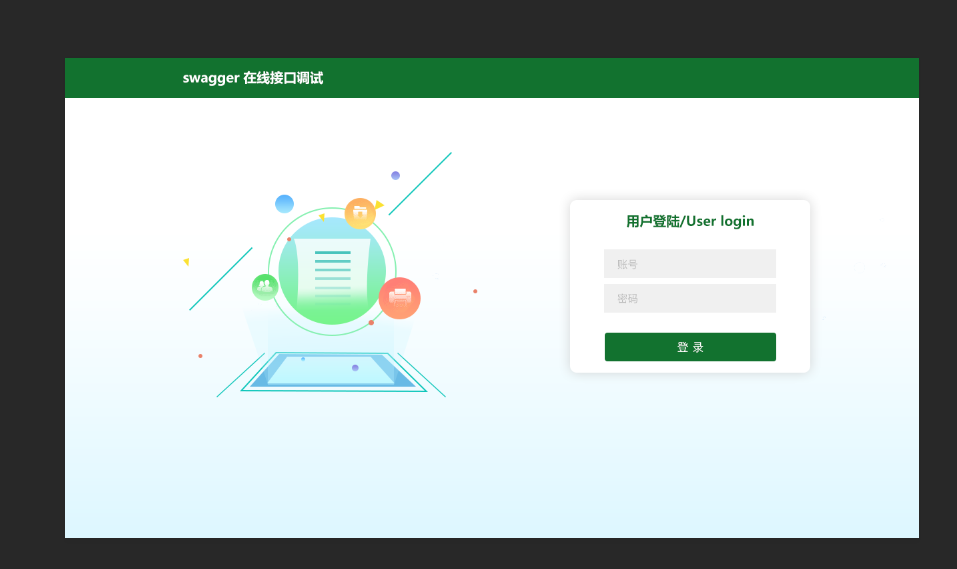
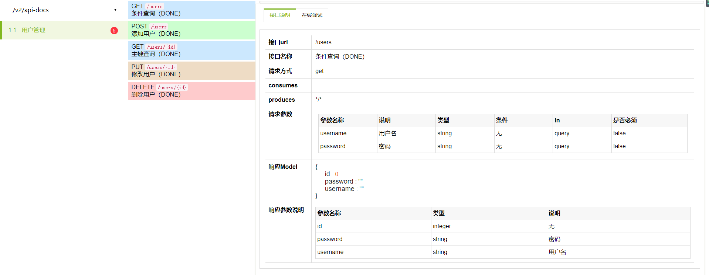
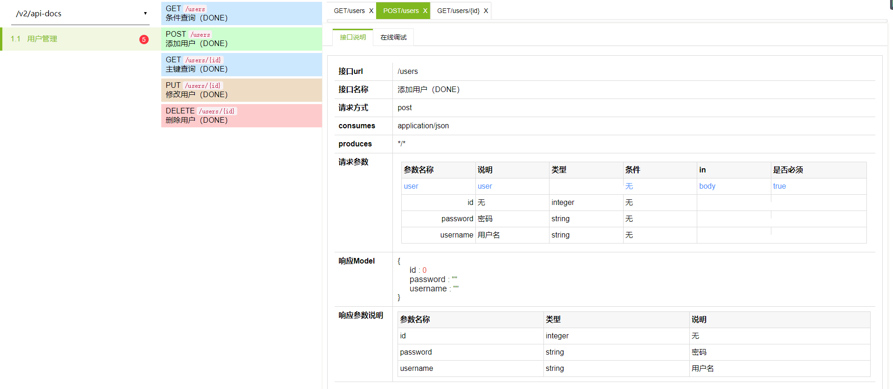
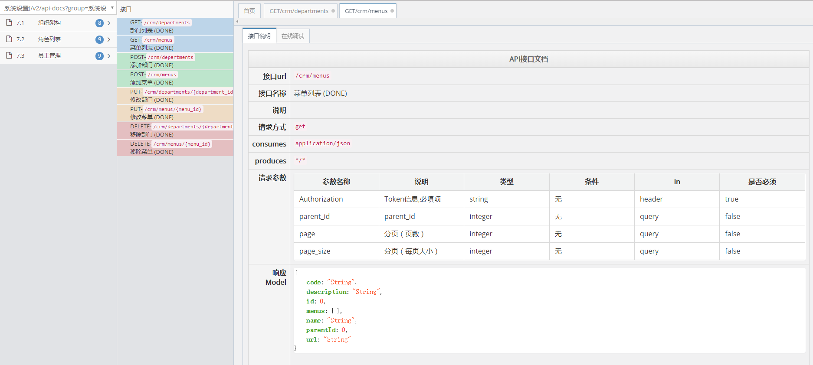
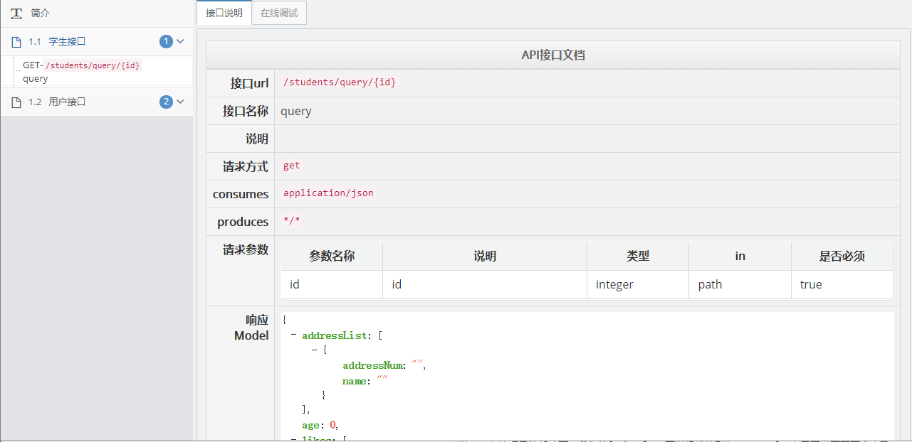
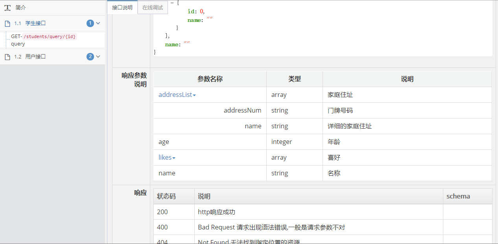
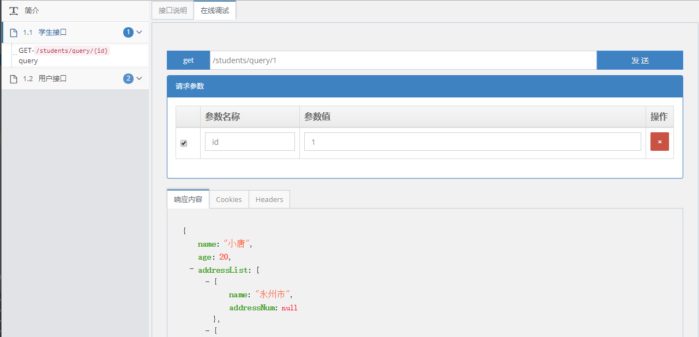

# 简介 #

> 什么是 swagger?

**`Swagger` 是一款自动生成在线文档 + 接口调试的工具。在 WEB 开发中不可否认的是我们需要给客户端提供 API 接口，这个时候需要借助 postman、rap 等工具
进行调试，以便于接口能正常交付给客户端人员，用过其它工具的应该知道一个 POST 请求一堆参数是非常枯燥且烦人的事情，而 swagger 就是让你摆脱这种束缚感....**


> 源码地址

- GitHub：[https://github.com/battcn/swagger-spring-boot](https://github.com/battcn/swagger-spring-boot "https://github.com/battcn/swagger-spring-boot")
- 码云：[https://gitee.com/battcn/spring-boot-starter-swagger/](https://gitee.com/battcn/spring-boot-starter-swagger/ "https://gitee.com/battcn/spring-boot-starter-swagger/")

`swagger-spring-boot-starter` 是一款建立在`swagger`基础之上的工具包，利用SpringBoot自动装配的特性，简化了传统`swagger`的繁琐配置

> 项目介绍

- **`swagger-vue` ：采用 Vue 编写的源代码，如果您对UI有更好的想法或者建议可以在该项目上进行扩展，它就是 UI 的源文件**
- **`swagger-vue-ui` ：编译后的纯 HTML 文件，如果你对 `swagger-spring-boot-starter` 包中的 UI 感到不满，你也可以选择排除 `swagger-vue-ui` 然后用第三方的...**
- **`swagger-spring-boot-starter` ： 自动装配 swagger 的扩展包**

有兴趣扩展自己的Starter包的可以参考文章：[编写自己的starter项目](http://blog.battcn.com/2017/07/13/springboot/springboot-starter-swagger/ "编写自己的starter项目")

**如果该项目对您有帮助，欢迎Fork和Star，有疑问可以加 `QQ：1837307557`一起交流 ，如发现项目BUG可以提交`Issue`**

# 使用 #

**1.X 版本需要在启动类添加 `@EnableSwagger2Doc` 但是 2.X 版本后无需添加，请知晓...**

- 在`pom.xml`中引入依赖：

``` xml
<dependency>
    <groupId>com.battcn</groupId>
    <artifactId>swagger-spring-boot-starter</artifactId>
    <version>2.1.0-RELEASE</version>
</dependency>
```

- 在`application.yml`中添加

``` yaml
spring:
  swagger:
    enable: true
```

- 在`application.properties`中添加

``` properties 
spring.swagger.enable=true
```


# 更新记录 #
```
2.1.0
  发布时间：2018-09-22
  更新内容：
    1.调试面板JSON渲染美化
    2.修复授权模式下任意密码可以登陆问题
    3.修复ApiModelProperty#required 不生效问题
2.0.7
  发布时间：2018-08-17
  更新内容：
    1.解决无请求参数无法调试，js报错
    2.解决编辑 json 会导致 json 加一个双引号传输
2.0.6
  发布时间：2018-07-25
  更新内容：
    1.解决请求错误时，异常信息不渲染的BUG
    2.优化登陆保存策略
2.0.5
  发布时间：2018-07-24
  更新内容：
    1.修复 spring.swagger.host 导致调试面板失效BUG
2.0.4
  发布时间：2018-07-23
  更新内容：
    1.修改未自动注入BUG（在2.0.3中需要写明 ComponentScan）
2.0.2（具体效果看 samples-basic 中的项目示例）
2.0.3
  发布时间：2018-07-17
  更新内容：
    1.UI美化
    2.路由优化
    3.文件上传控件美化
2.0.2（具体效果看 samples-basic 中的项目示例）
  发布时间：2018年07月10日
  更新内容：
    1.UI添加响应结果
    2.UI添加全局认证窗口
    3.修复接口过多导致内存溢出泄露BUG
    4.优化代码风格与标准
    5.美化弹窗
    6.添加安全验证过滤器（这样一来即使你想线上使用 swagger 一样可以）
    7.登陆UI，保障接口安全
    8.添加请求响应时间
    9.升级Spring Boot 版本为 2.0.3-RELEASE
2.0.1
  发布时间：2018年06月19日
  更新内容：
    1.重写UI
    2.升级Spring Boot 为2.0.2
    3.支持接口全局认证（设置一次 Token 需验证的地址自动将值写入到请求头/请求体中）
    4.全局响应返回
    5.支持可选的 Bean 验证插件；
        由于日常开发中发现默认启动的验证插件扫描耗时比较久（由于我电脑弱，扫描时间大概在3-5秒...）
        故而将插件修改为可选的，默认是关闭
    6.支持选项卡切换
    7.修复多余的斜杠
1.4.5
  发布时间：2018年04月26日
  更新内容：
    1.解决配置 `context-path` 导致 `swagger-ui.html` 无法显示BUG
1.4.4
  发布时间：2018年01月05日
  更新内容：
    1.优化选项卡切换
1.4.3
  发布时间：2017年12月22日
  更新内容：
    1.修复CRUL口令
    2.提升操作体验
1.4.2
  发布时间：2017年12月15日
  更新内容：
    1.修复CRUL口令
    2.渲染菜单列表颜色
1.4.1
  发布时间：2017年12月13日
  更新内容：
    1.修复CRUL口令
    2.修复DELETE类型请求部分存在404问题
1.4.0
  发布时间：2017年12月14日
  更新内容：
    1.PATCH无法正确渲染
1.3.9
  发布时间：2017年9月17日 
  更新内容：
    1.修复对象深度拷贝
1.3.8
  发布时间：2017年12月8日 
  更新内容：
    1. 解决1.1.0发版中的bug    
1.1.0
  发布时间：2017年12月1日
  更新内容：
    1. 完成基础功能
```

# 重写UI #

> 操作风格 - 2.0.2 版本

``` java
# 2.0.3 版本新特性（开启后访问 swagger-ui.html 会自动路由到登陆页面，保障接口信息不被暴露）
spring.swagger.security.filter-plugin=true
# 配置账号密码
spring.swagger.security.username=battcn
spring.swagger.security.password=battcn
```



> 操作风格 - 2.0.1 版本

``` java
# 配置
spring.swagger.api-key.key-name=myToken
# 2.0.1 版本新特性 （支持可选的 Bean 验证插件）
spring.swagger.validator-plugin=false
# 定义全局响应返回
spring.swagger.global-response-messages.POST[0].code=400
spring.swagger.global-response-messages.POST[0].message=server response 400
spring.swagger.global-response-messages.POST[1].code=404
spring.swagger.global-response-messages.POST[1].message=server response 404
```







> 操作风格 - 1.4.3支持



> 接口说明：折叠式Model




> 接口说明：折叠式表单响应内容，告别长长的滚动条



> 在线调试




## 配置说明 ##

`spring.swagger.enabled`：提供该配置目的是方便多环境关闭，一般生产环境中不会暴露它，这时候就可以通过 `java -jar xx.jar --spring.swagger.enabled=false` 动态关闭，也可以在多环境配置写好


### properties ###

```
spring.swagger.enabled=是否启用swagger，默认：true
spring.swagger.title=标题
spring.swagger.description=描述信息
spring.swagger.version=版本
spring.swagger.license=许可证
spring.swagger.licenseUrl=许可证URL
spring.swagger.termsOfServiceUrl=服务条款URL
spring.swagger.contact.name=维护人
spring.swagger.contact.url=维护人URL
spring.swagger.contact.email=维护人email
spring.swagger.base-package=swagger扫描的基础包，默认：全扫描
spring.swagger.base-path=需要处理的基础URL规则，默认：/**
spring.swagger.exclude-path=需要排除的URL规则，默认：空
spring.swagger.host=文档的host信息，默认：空
spring.swagger.globalOperationParameters[0].name=参数名
spring.swagger.globalOperationParameters[0].description=描述信息
spring.swagger.globalOperationParameters[0].modelRef=指定参数类型
spring.swagger.globalOperationParameters[0].parameterType=指定参数存放位置,参考ParamType:(header,query,path,body,form)
spring.swagger.globalOperationParameters[0].required=指定参数是否必传，默认false
#下面分组是
spring.swagger.groups.<name>.basePackage=swagger扫描的路径
#比如
spring.swagger.groups.基础信息.basePackage=com.battcn.controller.basic

# 关闭 JSR
spring.swagger.validator-plugin=false
# 全局消息体
spring.swagger.global-response-messages.GET[0].code=400
spring.swagger.global-response-messages.GET[0].message=server response 400
spring.swagger.global-response-messages.POST[0].code=400
spring.swagger.global-response-messages.POST[0].message=server response 400
spring.swagger.global-response-messages.POST[1].code=404
spring.swagger.global-response-messages.POST[1].message=server response 404
```


### yaml ###

以下为 `application.yml` 配置示例

``` yaml
spring:
  swagger:
    enabled: true
    title: 标题
    description: 描述信息
    version: 系统版本号
    contact:
      name: 维护者信息
    base-package: swagger扫描的基础包，默认：全扫描(分组情况下此处可不配置)
    #全局参数,比如Token之类的验证信息可以全局话配置
    global-operation-parameters:
    -   description: 'Token信息,必填项'
        modelRef: 'string'
        name: 'Authorization'
        parameter-type: 'header'
        required: true
    groups:
      basic-group:
        base-package: com.battcn.controller.basic
      system-group:
        base-package: com.battcn.controller.system
```


# 贡献者 #

Levin：1837307557@qq.com  

- 个人博文：[http://blog.battcn.com](http://blog.battcn.com "http://blog.battcn.com")

_Rock：995269937@qq.com


# 常用注解说明 #

* `@Api`:一般用于Controller中,用于接口分组。（**`如：@Api(value = "用户接口", description = "用户接口", tags = {"1.1.0"})`**

* `@ApiOperation`:接口说明,用于api方法上。（**`如： @ApiOperation(value = "用户查询", notes = "根据ID查询用户信息")`**）

* `@ApiImplicitParam`:参数说明,适用于只有一个请求参数,主要参数

* `@ApiImplicitParams`:多个参数说明,主要参数参考上面`@ApiImplicitParam`

* `@ApiModel`:实体类说明

* `@ApiModelProperty`：实体参数说明


# 如何参与 #

有兴趣的可以联系本人（Pull Request），参与进来一起开发，美化UI与配置项一起完善
